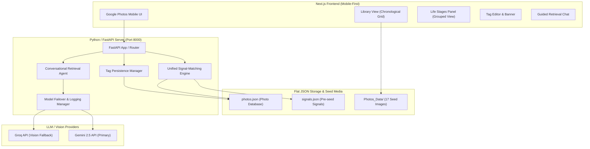
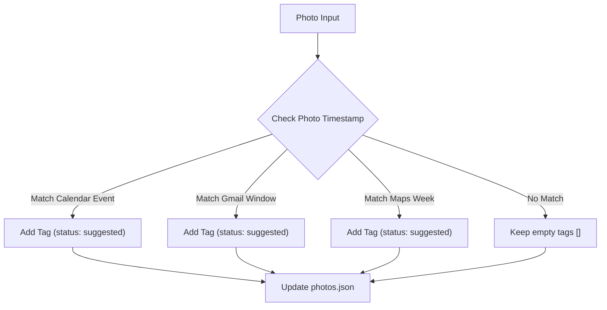
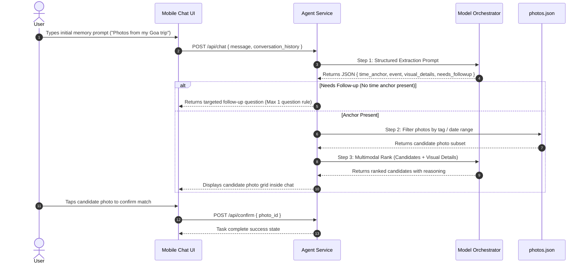
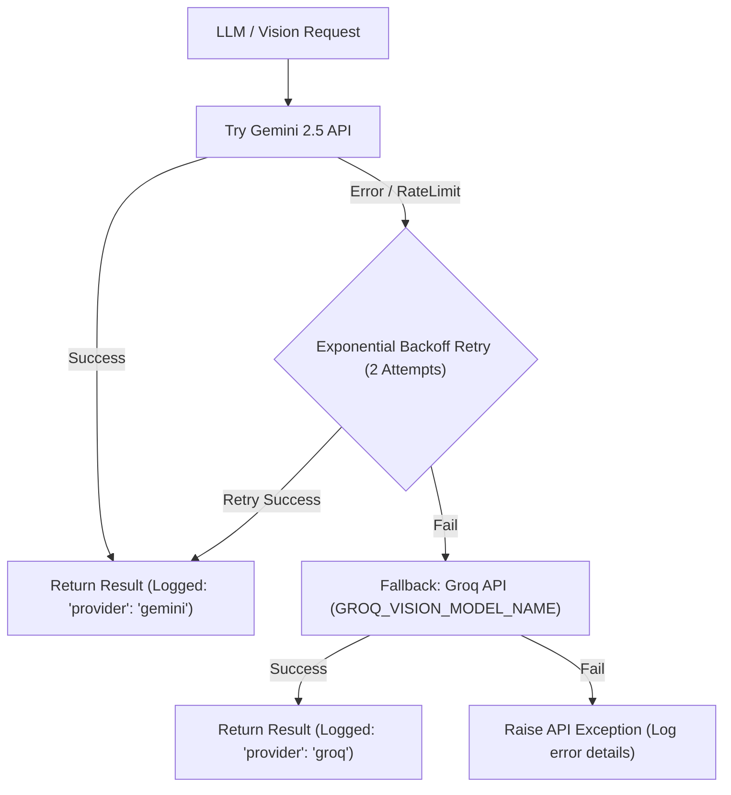

# Architecture Specification: Guided Memory Assistant (MVP)

> **Project:** Google Photos Graduation Project — Solution 1 of 3 (MVP)  
> **Reference Document:** [`PRD_Guided_Memory_Assistant.md`](file:///d:/Product%20Management/Projects/Graduation%20Project/Guided%20Search%20Assistant%20MVP/PRD_Guided_Memory_Assistant.md)  
> **Target Platform:** Mobile-first Responsive Web Application (Next.js + Python FastAPI)

---

## 1. Executive Summary & Architecture Goals

The **Guided Memory Assistant** is a standalone prototype built on top of the Google Photos experience. It bridges the gap between how human memory stores experiences (life stages, events, rough timeframes) and how search engines query media (literal terms or exact dates).

### Core Architectural Principles
1. **No RAG / No Vector Databases:** Search is powered by structured metadata filtering (`photos.json`) followed by direct **Multimodal Reasoning** (Gemini/Groq Vision) on the narrowed candidate set.
2. **Unified Signal-Matching Engine:** A single backend function evaluates photo timestamps against simulated signals (`signals.json`) both on startup and during new photo uploads.
3. **Resilient Model Pipeline:** Primary inference runs on Gemini with automatic backoff retry and seamless fallback to Groq Vision models, logging the execution path for every response.
4. **Authentic Google Photos Look & Feel:** Strict adherence to Google Photos UI patterns, interaction models, and verified brand colors:
   - **Blue:** `#4285F4`
   - **Red:** `#EA4335`
   - **Yellow:** `#FBBC04`
   - **Green:** `#34A853`

---

## 2. High-Level System Architecture



---

## 3. Technology Stack & Directory Layout

### Tech Stack Components

| Layer | Technology | Key Details |
|---|---|---|
| **Frontend** | Next.js 14+ (React / TypeScript) | Responsive mobile-first build, Tailwind CSS matching Stitch exports (`UI_Design/Mobile UI`). |
| **Backend** | Python 3.10+ / FastAPI | Async API service, Uvicorn server, Pydantic data schemas. |
| **Primary LLM/Vision** | Google Gemini 2.5 Flash / Pro | Structured extraction, public event resolution, multimodal candidate ranking. |
| **Fallback LLM/Vision** | Groq API (`qwen/qwen3.8-27b`) | Vision fallback with exponential backoff & path logger. |
| **Data Persistence** | Flat JSON (`photos.json`, `signals.json`) | Local file system storage with thread-safe JSON read/write handlers. |

### Directory Structure

```
Guided Search Assistant MVP/
├── .env                              # API keys and server configuration
├── PRD_Guided_Memory_Assistant.md    # Product Requirements Document
├── Architecture.md                   # Architecture Specification
├── Photos_Data/                      # 17 seed JPEG/PNG photo files
├── UI_Design/                        # Stitch UI export assets
│   ├── Mobile UI/                    # 9 Mobile UI design components
│   └── Desktop UI/                   # Desktop UI reference designs
├── backend/                          # Python FastAPI service
│   ├── app/
│   │   ├── main.py                   # FastAPI entrypoint & startup hooks
│   │   ├── config.py                 # Settings & env variable loader
│   │   ├── models/                   # Pydantic schemas (Photo, Tag, Signal)
│   │   ├── services/
│   │   │   ├── signal_engine.py      # Unified signal matching logic
│   │   │   ├── tag_service.py        # Tag CRUD & persistence
│   │   │   ├── agent_service.py      # Conversational extraction & filter logic
│   │   │   └── llm_orchestrator.py   # Gemini primary + Groq fallback client
│   │   └── data/
│   │       ├── photos.json           # Active photo database
│   │       └── signals.json          # Pre-seeded signal definitions
├── frontend/                         # Next.js Application
│   ├── src/
│   │   ├── app/                      # App router pages & layouts
│   │   ├── components/               # Google Photos mobile components
│   │   ├── hooks/                    # Custom React hooks (usePhotos, useChat)
│   │   └── lib/                      # API client & state utilities
```

---

## 4. Data Models & File Specifications

### 4.1 `photos.json` Specification

The starting `photos.json` begins with an empty `tags: []` array for every photo. On backend startup, the Unified Signal-Matching Engine populates matching `"suggested"` tags live.

```json
[
  {
    "id": "newjob_01",
    "filename": "newjob_01.jpg.jpg",
    "timestamp": "2023-03-02",
    "tags": [
      {
        "label": "Started New Job",
        "status": "suggested"
      }
    ]
  },
  {
    "id": "general_01",
    "filename": "general_01.jpg.png",
    "timestamp": "2022-09-10",
    "tags": []
  }
]
```

* **`status` Types**:
  - `"suggested"`: Auto-detected tag from signals. Visually rendered with dotted borders or a "suggested" badge.
  - `"confirmed"`: User-applied or user-accepted tag. Rendered as a solid, confirmed tag badge.

### 4.2 `signals.json` Specification

Pre-seeded signals representing simulated Calendar, Gmail, and Maps data:

```json
{
  "calendar_events": [
    { "title": "First day — new job", "date": "2023-03-01", "inferred_tag": "Started New Job" }
  ],
  "gmail_signals": [
    { "subject": "Redbus booking confirmation — Goa", "date_range": ["2022-06-14", "2022-06-18"], "inferred_tag": "Goa Trip" }
  ],
  "maps_signals": [
    { "pattern": "location_change", "detected_week": "2023-08-07", "inferred_tag": "Moved to New City" }
  ]
}
```

> **Note on Public Events**: Public events (e.g. "Diwali 2023") are NOT in `signals.json`. They are resolved dynamically via Gemini's world knowledge during conversation processing (Section 6.2).

---

## 5. Layer 1 — Tagging & Signal-Matching Engine

### 5.1 Unified Signal-Matching Logic

A single function `apply_signal_matching(photo: Photo, signals: Signals) -> Photo` handles tag suggestions:



#### Execution Contexts
1. **Startup Check**: Invoked on backend startup across all 17 seed photos in `Photos_Data/`.
2. **Simulated Upload Check**: Invoked when the user taps "Upload" (pulling from the pre-generated upload image pool).

### 5.2 Tag Management Operations

Supported CRUD actions on `photos.json`:
- **Assign Tag**: Selected photo(s) receive tag (`status: "confirmed"`).
- **Confirm Suggestion**: Changes status from `"suggested"` to `"confirmed"`.
- **Rename Tag**: Updates all occurrences of tag `label` across `photos.json`.
- **Remove Photo from Group**: Removes specified tag from targeted photo.
- **Merge Tag Groups**: Replaces `label_A` with `label_B` across all photos.
- **Delete Tag Group**: Removes specified tag group from all photos (never deletes underlying image files).
- **Bulk Date-Range Tagging**: Assigns tag to all photos falling within a selected timeline date range `[start_date, end_date]`.

### 5.3 Check-in / Notification Banner Logic
- On session load or photo upload, the backend checks for any photo with an **unconfirmed/unacknowledged** `"suggested"` tag.
- If found, the frontend displays the check-in banner: *"We noticed a new regular location — want to tag this as a life stage?"*
- Accepting converts the tag to `"confirmed"`; dismissing keeps it `"suggested"`.

---

## 6. Layer 2 — Guided Retrieval Agent Pipeline

### 6.1 Conversational Data Flow



### 6.2 Public Event Resolution Pathway
When a user refers to a public event without an explicit date (e.g., "Diwali 2023"):
1. The Agent Service prompts Gemini to extract the event name.
2. Gemini resolves "Diwali 2023" to the date range `2023-11-10` to `2023-11-15`.
3. The date range is used as a filter criteria against `photos.json`.

### 6.3 Resilient Model Orchestrator & Fallback Protocol



Every model response returns execution metadata:
```json
{
  "content": "...",
  "meta": {
    "provider_used": "gemini",
    "attempts": 1,
    "latency_ms": 420
  }
}
```

---

## 7. UI Component Mapping (Mobile-First)

The frontend maps directly to the Stitch components located in [`UI_Design/Mobile UI/`](file:///d:/Product%20Management/Projects/Graduation%20Project/Guided%20Search%20Assistant%20MVP/UI_Design/Mobile%20UI):

| Mobile UI Package | Corresponding Screen / Component | Description |
|---|---|---|
| `google_photos_mobile_library` | **Screen 1: Library View** | Chronological photo grid with timeline dates, tag badges (`suggested`/`confirmed`), search bar & bottom navigation. |
| `google_photos_mobile_life_stages` | **Screen 2: Life Stages Panel** | Grouped grid view by tag subheadings (patterned after Google Photos' "People & Pets"). |
| `google_photos_mobile_life_stage_detail_management` | **Screen 3: Tag Management** | Detail view for managing photos within a specific tag group. |
| `google_photos_mobile_review_suggestions` | **Screen 3 / Banner** | UI modal/banner for reviewing auto-suggested tags. |
| `google_photos_mobile_tag_assignment_1` & `2` | **Screen 3: Tag Editor** | Multi-select timeline view to assign tags or perform bulk date-range tagging. |
| `google_photos_mobile_guided_retrieval` | **Screen 4 & 5: Retrieval Chat** | Dedicated entry point affordance and conversational chat UI. |
| `google_photos_candidate_confirmation_mobile` | **Screen 5: Match Confirmation** | Embedded grid in chat for user confirmation of candidate photos. |

---

## 8. Out-of-Scope & Operational Guardrails

- **No Real OAuth Integration**: Calendar, Gmail, and Maps signals are simulated from `signals.json`.
- **No Vector Embeddings / RAG**: Retrieval relies strictly on metadata filtering + multimodal vision analysis.
- **No Host-Specific Assumptions**: Containerized/deployable setup without hardcoded URLs.
- **Strict Scope Enforcement**: Non-retrieval conversational requests are politely redirected back to photo memory search.
